# 项目环境搭建

1. 拷贝项目  
  在本地创建一个workspace文件夹，同时在此目录下通过`git clone [url]`命令，拷贝本项目到本地。  
1. 安装IDEA  
  下载符合自己系统的 [intelliJ IDEA 社区版](https://www.jetbrains.com/idea/download/#section=mac) 并安装。
1. 安装PostgresSQL 12  
  下载符合自己系统的 [PostgresSQL 12](https://www.enterprisedb.com/downloads/postgres-postgresql-downloads) 并安装。[※安装方法参考](https://www.runoob.com/postgresql/mac-install-postgresql.html)  
  安装完后，依照下面的方法启动数据库，并导入数据。  
  **Mac:**  
  执行以下脚本启动 PostgreSQL。  
    ```
    $ /Library/PostgreSQL/11/scripts/runpsql.sh ;exit
    Server [localhost]:
    Database [postgres]:
    Port [5432]:
    Username [postgres]:
    Password for user postgres:【输入密码】
    psql (12)
    Type "help" for help.
    postgres=#
    ```
    并输入以下命令，执行本项目的DDL文件，创建本项目所用的数据库内容  
    ```
    postgres=# \i /Users/XXX/workspace/nesder/doc/ddl/setup.sql(本地目录)
    ```
    **Winows:**  
    在“开始-所有程序-PostgreSQL 12”中找到SQL Shell (psql)  
    如果失败，请使用管理员权限打开
    ```
    > Server [localhost]:
    Database [postgres]:
    Port [5432]:
    Username [postgres]:
    Password for user postgres:【输入密码】
    psql (12)
    Type "help" for help.
    postgres=#
    ```
    并输入以下命令，执行本项目的DDL文件，创建本项目所用的数据库内容  
    ```
    postgres=# \i C:XXX/workspace/nesder/doc/ddl/setup.sql(本地目录)
    ```
1. 安装Node.js[※NodeJS安装方法参考](https://www.runoob.com/nodejs/nodejs-install-setup.html)    
  并执行一下命令，安装live-server
[about live-server](https://www.npmjs.com/package/live-server)  
    **Mac:**
    ```
    $ sudo npm install -g live-server
    ```
    **Winows:**  
    如果失败，请使用管理员权限安装
    ```
    > npm install -g live-server
    ```  
1. 安装Chrome插件Postman API接口测试工具或其他API测试工具[※插件地址](https://chrome.google.com/webstore/detail/postman-interceptor/aicmkgpgakddgnaphhhpliifpcfhicfo?hl=zh-CN)

# 项目启动
1. 启动intelliJ IDEA，通过[open]将本项目导入  
  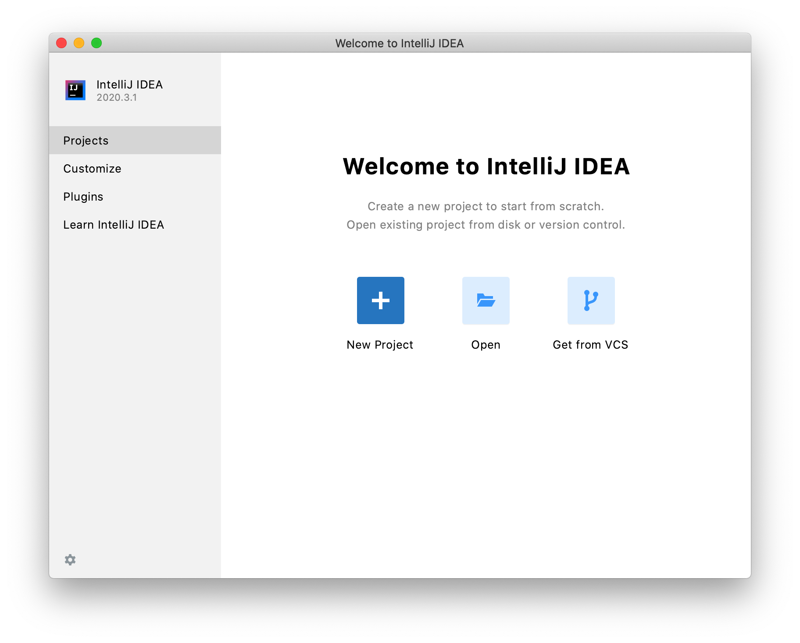  
  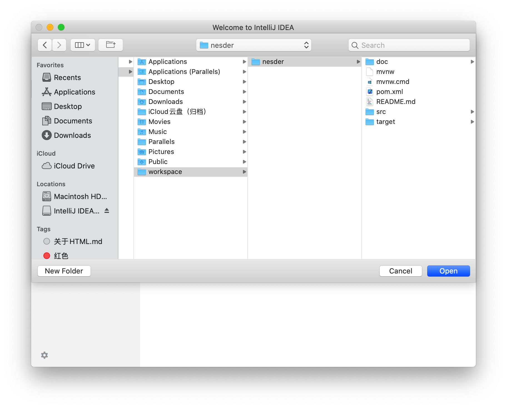  
2. 点击右下角的[load Maven Projec]来自动导入Maven的依赖项  

  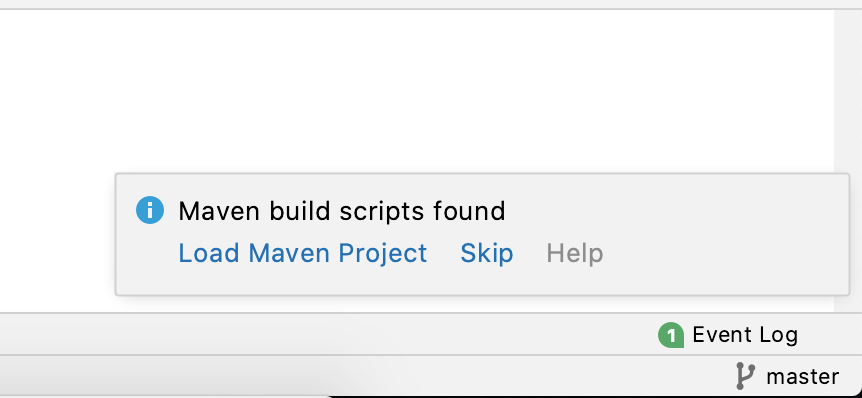  
3. 右键项目打开[Moduls Settings]  

  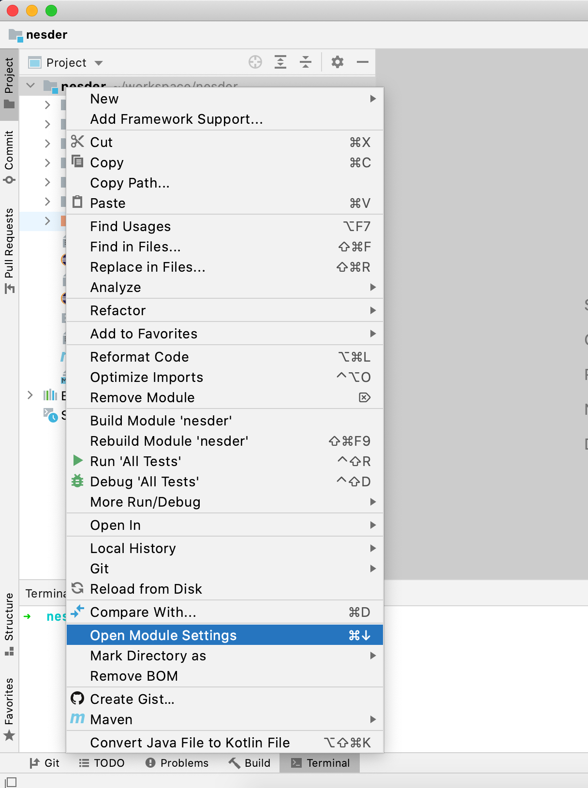  
4. 依次配置本项目的SDK，模块的[language level]以及SDKs为java 11  
  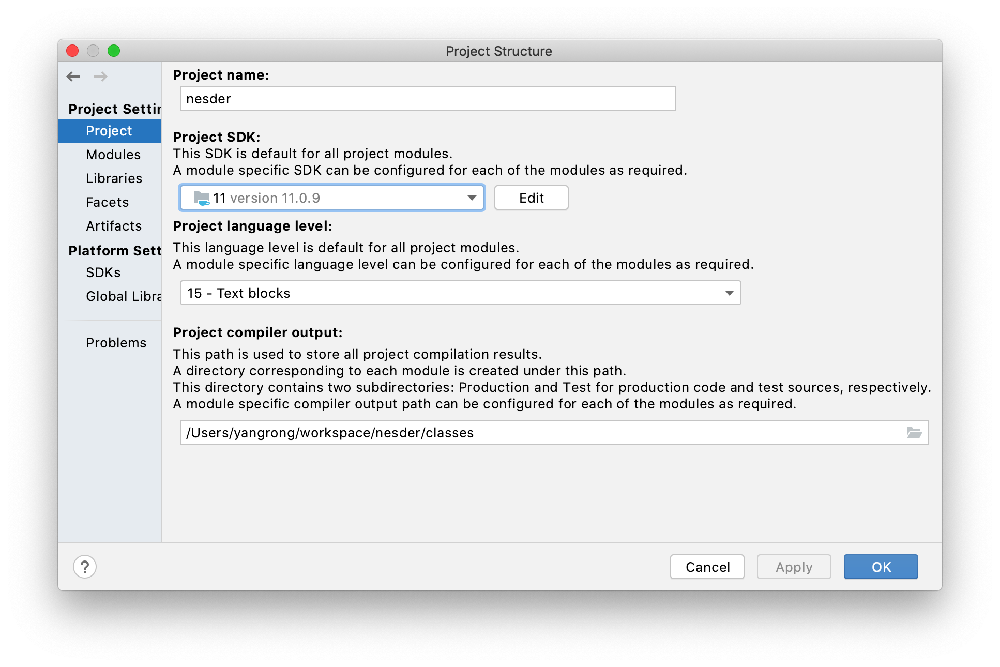  
    
  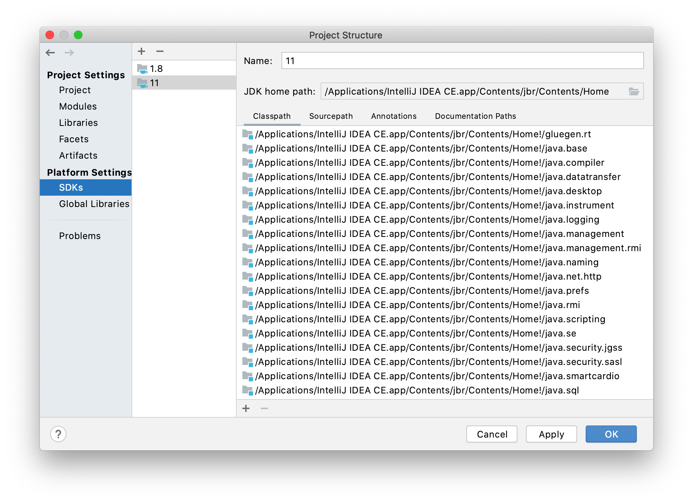  
5. 右键项目点击[Build Module 'XXX']编译  
    
6. 若出现下面字段，便为编译成功  
  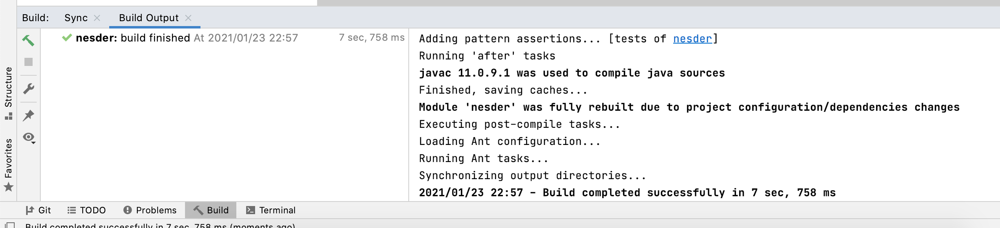  
7. 右键项目点击[Run 'XXX']启动项目  
  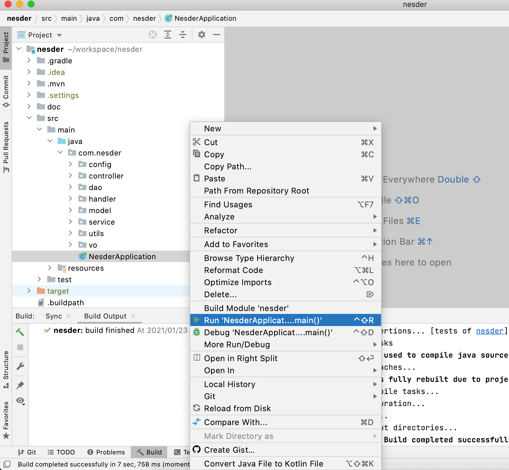  
8. 若出现下面字段，便为启动成功  
  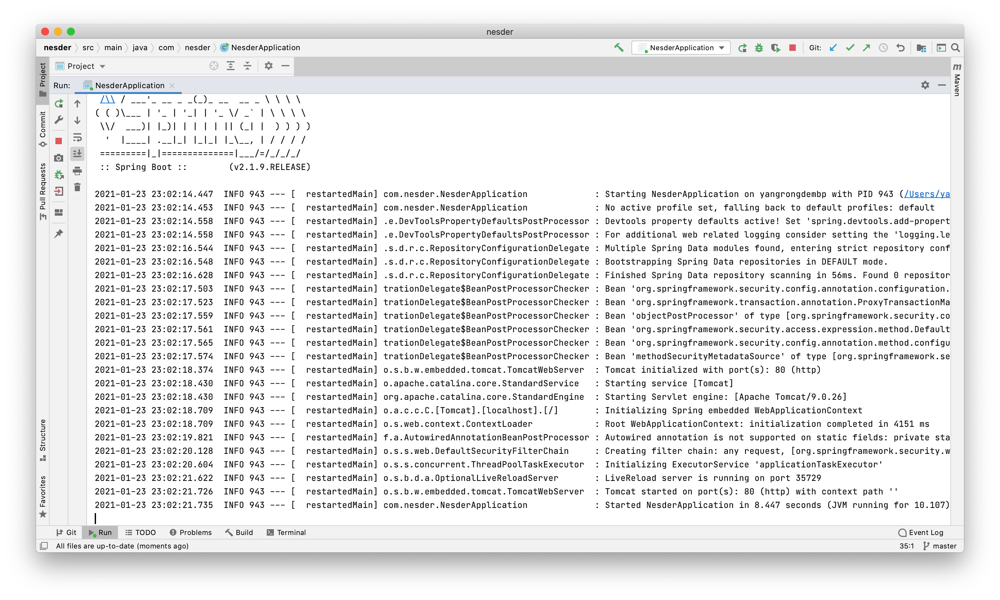  
9. 今后启动项目或者debug启动，只需点击下图按钮即可  
  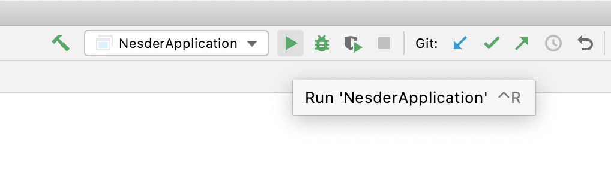  
  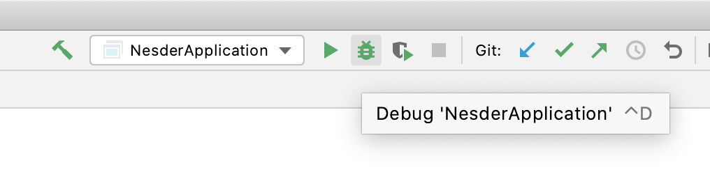  

# 接口测试
打开PostMan(或者其他API测试工具)，输入以下URL(localhost/nesder/account/all)，并发送GET请求。若能看到下面这样的response，即服务器搭建成功！
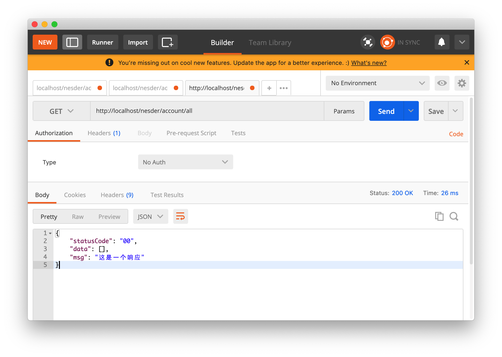

# 启动前端服务
执行以下命令，本地开启http服务器  

**Mac:**
```
$ cd /Users/XXXX/workspace/nesder/src/main/resources/webApp
$ sudo live-server -p 8080(如果失败，就去掉“-p 8080”)
Password:
Starting up live-server, serving ./
Available on:
  http://127.0.0.1:8080
  http://192.168.2.104:8080
Hit CTRL-C to stop the server
```
**Winows:**
```
> cd C://XXXX/workspace/nesder/src/main/resources/webApp
> live-server -p 8080(如果失败，就去掉“-p 8080”)
Password:
Starting up live-server, serving ./
Available on:
  http://127.0.0.1:8080
  http://192.168.2.104:8080
Hit CTRL-C to stop the server
```

本地服务器启动完成之后，命令行窗口会输出两个地址  
本机访问的话，两个地址都可以；
手机或其他设备连接，请使用其中有ip的那个地址访问，并且手机或者其他设备与本机必须在同一局域网下。  
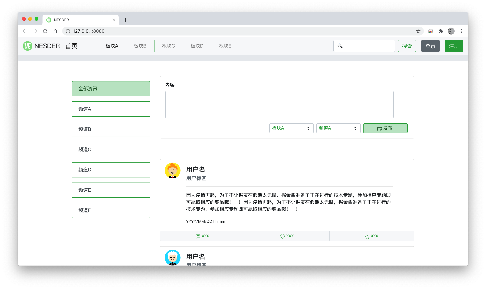
